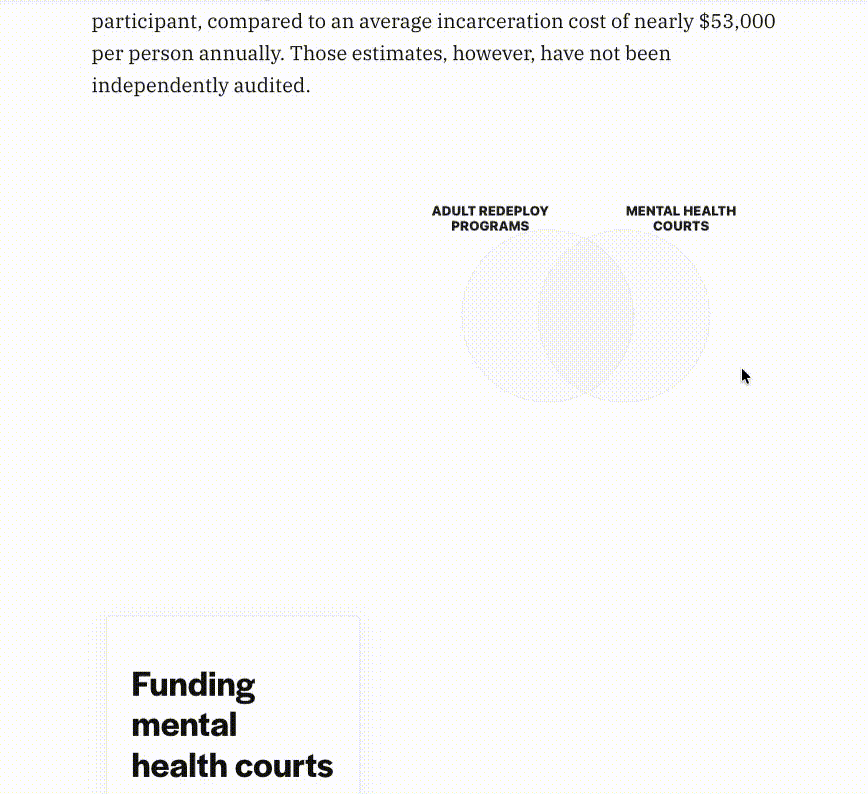
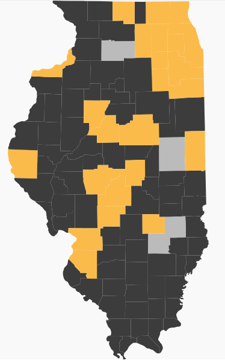
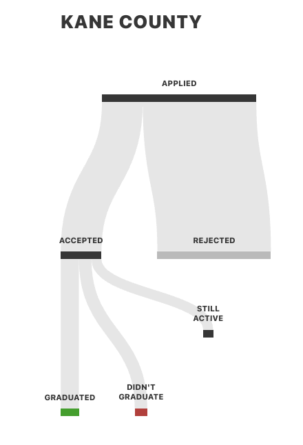
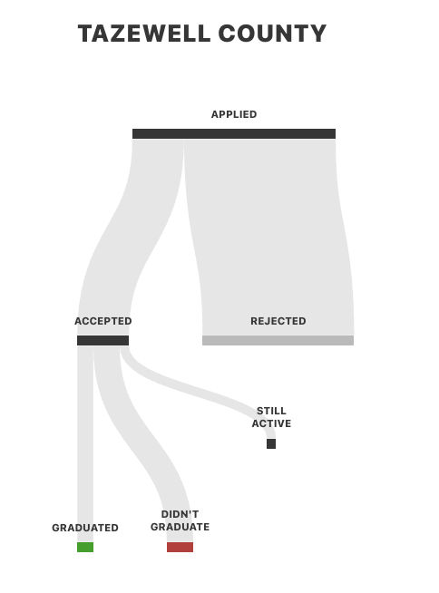
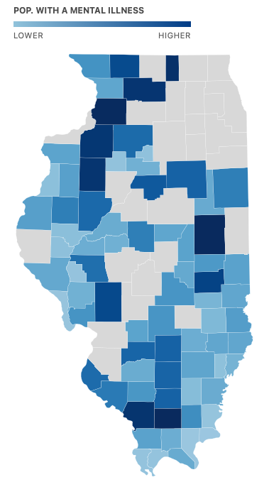
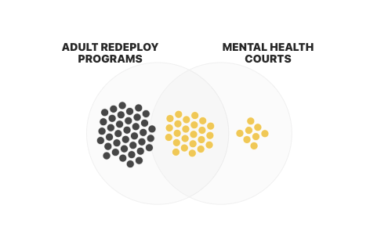
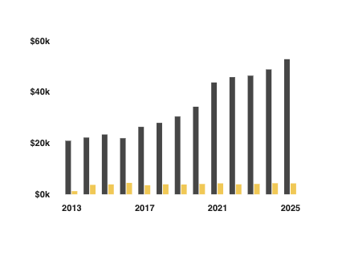

# Mental Health Court Graphics

Here is the code for five custom built graphics for a collaborative story reported by a team of reporters from the Illinois Answers Project and MindSite News. Static versions of these graphics -- with and without text -- can be found in the [images folder](./images/). We reccomend using the dynamic/interctive versions, if you can. Please find further guidance on static versions below. 

We hope these assets will be useful to you in telling the story of mental health courts in Illinois. If you have questions, email aadams@bettergov.org or call 312-291-1417. 

## [County Selector](https://github.com/aadams-bga/mentalHealthCourts/blob/main/county-selector.html)

## [Chronological Map](https://github.com/aadams-bga/mentalHealthCourts/blob/main/chrono-map.html)

## [Sankey Scroller](https://github.com/aadams-bga/mentalHealthCourts/blob/main/sankey-scroll.html)

## [SAMSHA Map](https://github.com/aadams-bga/mentalHealthCourts/blob/main/samsha-map.html)

## [ARI Scroller](https://github.com/aadams-bga/mentalHealthCourts/blob/main/ari-scroll.html)

# Using static images for IAP/MindSite's mental health courts graphics
If, for technical or aesthetic reasons, you choose to republish the IAP/MindSite investigation into mental health courts without using the interactive code provided elsewhere in this repository, we encourage you to represent the graphics statically. We have provided PNG images in the [linked folder](./images/). Please credit images to "Illinois Answers Project and MindSite News" 

Please use the following copy to accompany those graphics, if used online. Approximate placements for images have been included where appropraite. 

## Chronological map 
**More than 30 mental health courts have opened over the past two decades**
Since Cook and DuPage counties opened the state’s first mental health courts in 2004, other counties have opened similar courts based on the problem-solving court model. 

## Sankey data
**Tracking outcomes**
Using data from Kane County, we were able to track the outcomes of more than 200 people who applied to mental health court between 2020 and 2024. Of the applications, 81% were rejected, highlighting the narrow population that is found eligible for mental health court. Of those accepted, 59% successfully completed the program. Half of those who didn’t complete  the program were sent to a facility run by the state prison system. The rest voluntarily withdrew or couldn’t continue due to factors such as illness. A small number continue to be active in the program.

Tazewell County has seen similar trends — but with a lower graduation rate. Over the past decade, 38% of people who went through mental health court there graduated.

Tazewell's neighbor Peoria County had a higher rate of success in recent years: 63% graduated between 2022 and 2025. But the total numbers are small. About 60 people in Tazewell and Peoria completed the programs.

These similarities persist across the state. Most programs graduate around 55% of participants, but outliers exist. Adams County has a 25% graduation rate, and DuPage County claims to graduate 79%.

## SAMSHA map
**About 1 in 6 people with a mental illness live in counties without mental health courts** 
Roughly 2 million people in Illinois live in one of the state’s 77 counties that don’t have a mental health court. That includes about 350,000 people with mental illness, based on 2019 survey data from the Substance Abuse and Mental Health Services Administration.    These counties tend to be more rural and have a median income 19% lower than counties with mental health courts. 

## ARI scroller 
More than half of mental health courts in the state receive funding from Adult Redeploy Illinois. Others are funded through federal and local grants. While mental health courts are a significant portion of Adult Redeploy’s programming, the initiative also funds other similar programs, like drug court and intensive supervision probation. 

Adult Redeploy cost $4,277 per person last year. That’s an average cost across all types of diversion programs. Meanwhile, prison cost $52,810 per person last year. That is more than 10 times the average cost of a diversion program. Adult Redeploy estimates its diversion programs have saved taxpayers almost half a billion dollars in avoided prison costs over the last 15 years. 

